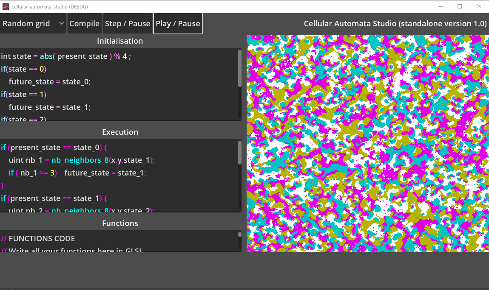

# Cellular Automata Studio
 A plugin for Godot to create cellular automata in Compute shaders (GLSL).
 

**[Cellular Automata Studio](https://virtulab.univ-brest.fr) is an addon for Godot Engine that enables you to write Cellular automata using Compute Shaders, for speed.**

**Several examples are available: test them to understand how they work and what can be done**

**Tutorial**
After importing the plugin, activate it (AssetLib => Extension => Activate).

Now you can add a node called CellularAutomataStudio.

Select it.

Add your different states thanks to the Cell states property:
  - for each state, put a name then a color.
  - They now can be used in your code.

Add a Sprite2D or a TexturedRect to display your cellular automata grid:
  - then drag & drop it into the property DisplayIn of the CellularAutomataStudio property

Fill the properties init_code, exec_code and functions_code with GLSL code.
  - Try the simple examples or 
  - directly code with the standalone example
  - The init_code is called at the beginning of launch of your application
  - The exec_code is called evry frame
  - The functions_code allow you to write your own functions.

